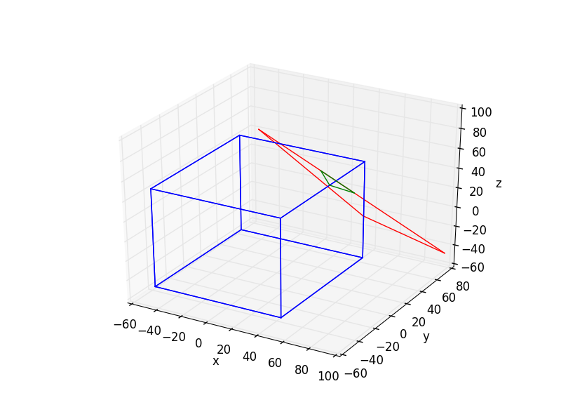

[![License][s1]][li]

[s1]: https://img.shields.io/badge/licence-GPL%203.0-blue.svg
[li]: https://raw.githubusercontent.com/matt77hias/Clipping/master/LICENSE.txt

# Clipping
Clipping utilities.

## About
A small clipping library supporting Sutherland-Hodgman and Robust Sutherland-Hodgman polygon clipping (against axis-aligned planes in 2D or boxes in 3D).

## Use
<p align="center"></p>

```python
from numpy import array
from test import plot_clip_AABB_robust

# The vertices of the polygon to clip
p_vs = [array([0.0, 0.0, 95.0]), array([80.0, 0.0, 32.0]), array([100.0, 75.0, -45.0])]

# The min and max bounds of the Axis Aligned Bounding Box used for clipping
pMin = array([-50.0, -50.0, -50.0])
pMax = array([50.0, 50.0, 50.0])

# Robust Sutherland-Hodgman as described in C. Ericson's Real-Time Collision Detection with my own addition of ensuring no duplicate vertices
plot_clip_AABB_robust(p_vs, pMin, pMax)
```

Note that optimizations, method reuse and Python specific shorthands are still possible. The code however is currently easy portable to C, C++, C# and Java.

## Bibliography
ERICSON C.: *Real-Time Collision Detection*. CRC Press, Inc., Boca Raton, FL, USA, 2004.

SUTHERLAND I. E., HODGMAN G. W.: Reentrant Polygon Clipping. *Communications of the ACM 17*, 1 (jan 1974), pp. 32-42.
